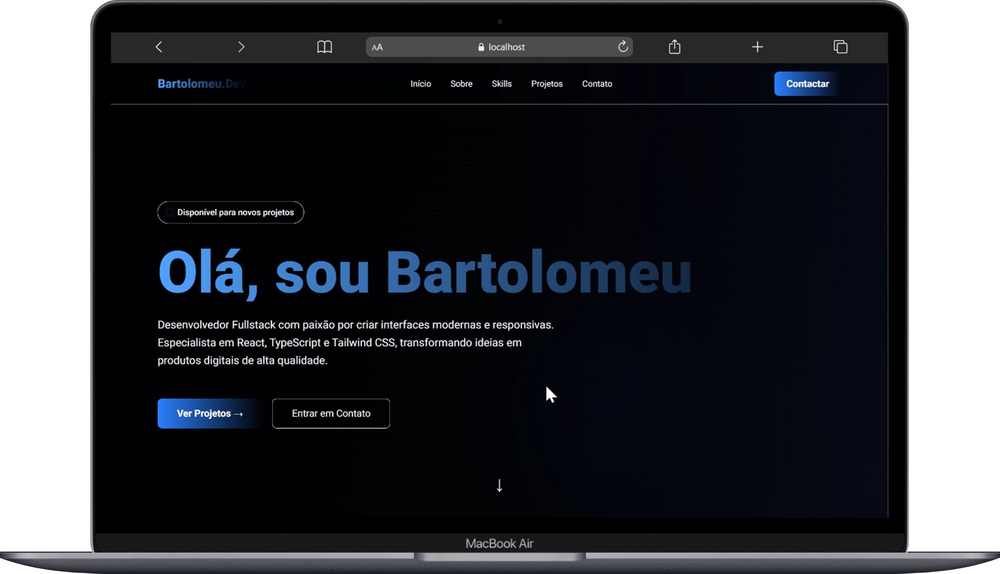

# Portfólio - Bartolomeu



Bem-vindo ao meu portfólio pessoal criado com React, Vite e Tailwind CSS.

Este projeto apresenta meus trabalhos, habilidades técnicas e formas de contato de forma elegante, rápida e responsiva.

## 🚀 Visão geral

- **Framework:** React + Vite
- **Estilização:** Tailwind CSS
- **Componentes modernos:** Navbar fixa, hero com CTA, cards de projetos, barra de skills e formulário de contato
- **Seções principais:** Home, Sobre, Skills, Projetos e Contato
- **Portfólio direcionado a:** empresas e clientes que buscam desenvolvimento web front-end e fullstack

## 💡 O que você encontra aqui

- **Hero chamativo:** apresentação pessoal com chamada para ação para ver projetos ou entrar em contato
- **Sobre mim:** experiência em desenvolvimento web com foco em performance, design e usabilidade
- **Skills:** principais tecnologias utilizadas, como React, JavaScript, Tailwind CSS, PHP, Laravel, MySQL e GitHub
- **Projetos reais:** exemplos de sites institucionais e sistemas com repositórios disponíveis no GitHub
- **Contato:** formulário funcional e links diretos para e-mail, LinkedIn e GitHub

## 🛠️ Tecnologias utilizadas

- React
- Vite
- Tailwind CSS
- React Icons
- Font Awesome
- PHP / Laravel
- MySQL

## 📁 Projetos em destaque

O portfólio exibe projetos com descrição, tecnologias usadas e link para o repositório no GitHub.

Alguns exemplos:

- **Consultório Winners** – site institucional para consultório contábil
- **Colégio Pedro Pitágoras** – site institucional para escola
- **DDK Motos** – sistema de gestão de veículos e motoqueiros

## ⚙️ Como executar localmente

1. Instale as dependências:

```bash
npm install
```

2. Execute em modo de desenvolvimento:

```bash
npm run dev
```

3. Abra o navegador em:

```bash
http://localhost:5173
```

## 📬 Contato

- **E-mail:** `bartolomeunhongo@gmail.com`
- **LinkedIn:** [perfil](https://www.linkedin.com/in/bartolomeu-sebasti%C3%A3o-33a91b2b2)
- **GitHub:** [bartolomeu18](https://github.com/bartolomeu18)

## ✨ Destaques do portfólio

- Design responsivo e moderno
- Experiência em front-end e back-end
- Foco em performance e usabilidade
- Código limpo com componentes reutilizáveis

---

Feito com paixão por desenvolvimento e atenção aos detalhes.
